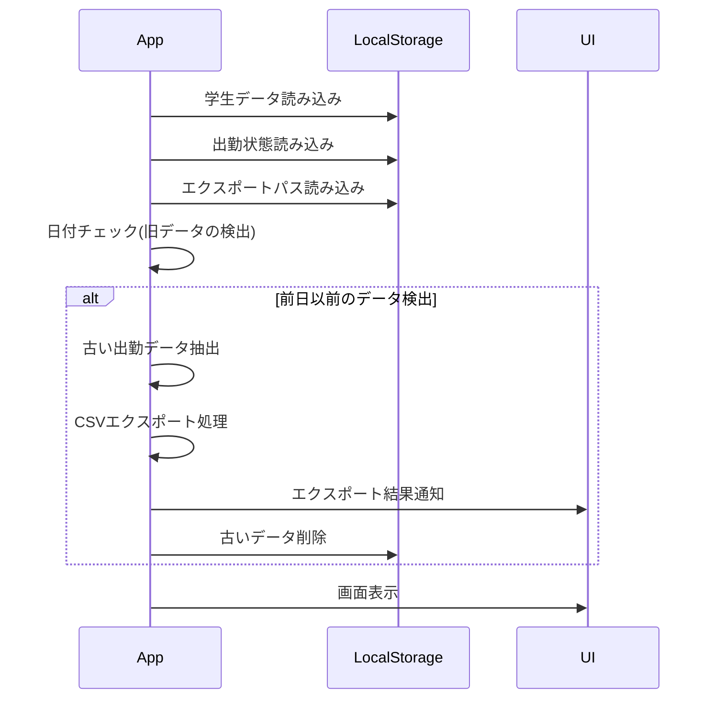
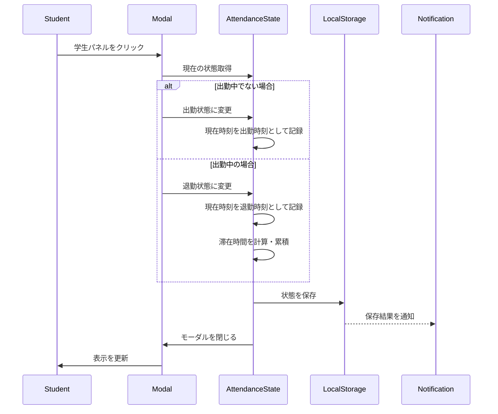
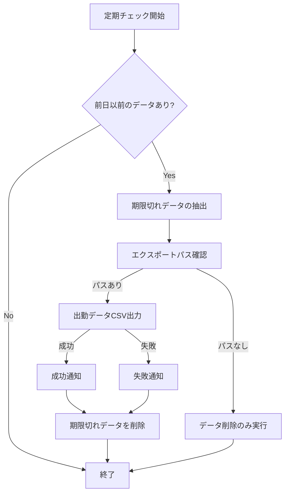
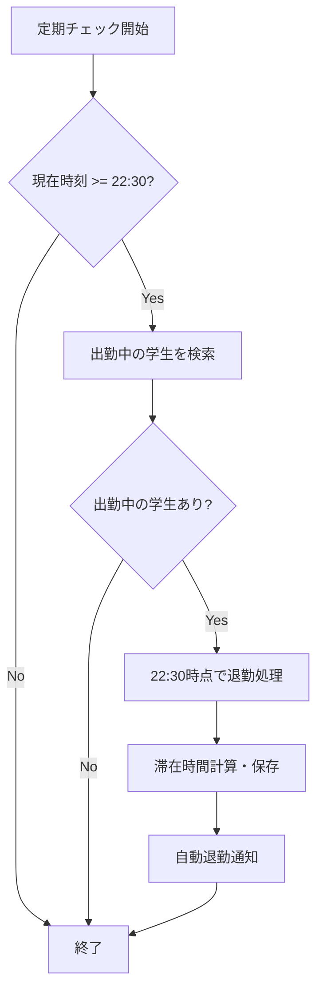
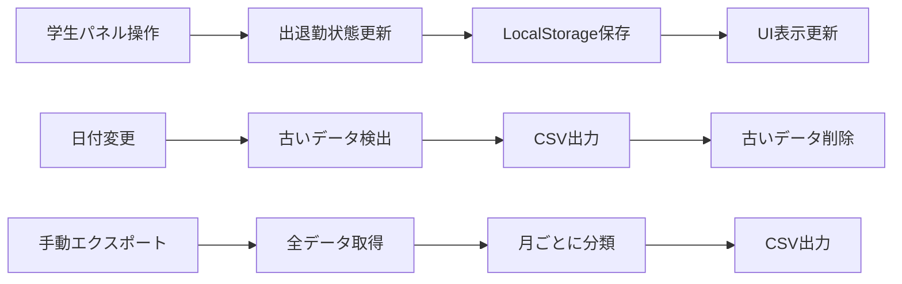
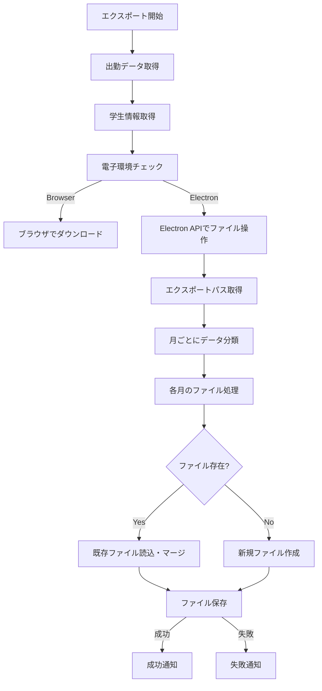
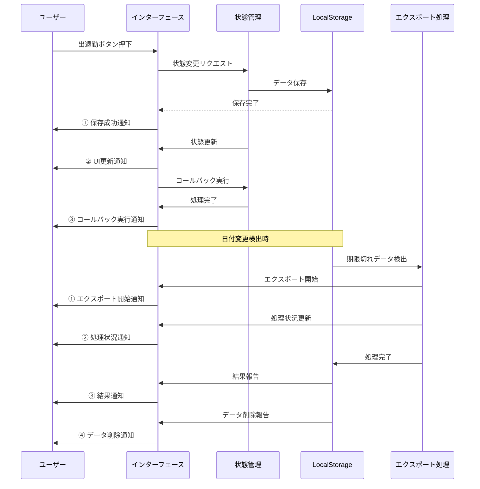

# LAMS (Laboratory Attendance Management System)

## システム概要

LAMSは研究室向けの出退勤管理システムです。学生の出勤・退勤状況を記録し、CSV形式でデータをエクスポートする機能を提供します。

## 主要機能

- 学生の出退勤管理
- 出勤データの自動・手動エクスポート
- 学生情報の管理（追加・削除・編集）
- 出勤統計の表示

## システムロジック・フロー

### 1. アプリケーション起動時



### 2. 出退勤処理フロー



### 3. 自動エクスポート処理

以下の条件でアプリが自動的にデータをエクスポートします：

1. アプリ起動時に前日以前のデータを検出した場合
2. 日付が変わったタイミング（定期チェック）



### 4. 自動退勤処理

22:30を過ぎた時点で出勤中の学生を自動的に退勤状態に更新します：



### 5. 通知が複数回発生するケース

通知が複数回発生するのは主に以下のシナリオです：

1. **出退勤状態変更時の通知シーケンス**
   - ローカルストレージ保存成功通知
   - 状態変更通知（UI更新用）
   - 外部コールバック実行通知（親コンポーネント用）
   - 期限切れデータがある場合のエクスポート通知

2. **エクスポート処理時**
   - エクスポート開始通知
   - 処理状態通知（各ステップ）
   - 結果通知（成功/失敗）
   - 後処理通知（データクリーンアップ等）

## データフロー

### 出勤データの流れ



### CSVエクスポート処理



## データ構造

### 学生データ

```typescript
interface Student {
  id: string;      // 学生ID
  name: string;    // 学生名
  grade: '教員' | 'M2' | 'M1' | 'B4';  // 学年
}
```

### 出勤状態データ

```typescript
interface AttendanceState {
  isAttending: boolean;      // 出勤中かどうか
  attendanceTime: Date | null;  // 出勤時刻
  leavingTime: Date | null;     // 退勤時刻 
  totalStayTime: number;        // 累積滞在時間（秒）
}
```

### CSVエクスポート形式

| 日付 | 学生ID | 学生名 | 出勤日時 | 退勤日時 | 滞在時間（秒） | 滞在時間 |
|------|--------|--------|----------|----------|----------------|----------|
| MM/DD | ID | 名前 | YYYY/MM/DD HH:MM:SS | YYYY/MM/DD HH:MM:SS | 12345 | X時間Y分 |

## 処理タイミングの詳細

LAMSシステムでは、以下の主要なタイミングで処理が実行されます。

### 1. アプリケーション起動時

<table>
<tr>
<th width="20%">トリガー</th>
<th width="40%">実行される処理</th>
<th width="20%">通知</th>
<th width="20%">影響範囲</th>
</tr>
<tr>
<td>アプリ起動</td>
<td>
• LocalStorageから学生データ読み込み<br>
• LocalStorageから出勤状態読み込み<br>
• エクスポート設定の読み込み<br>
• 前日以前のデータがあるか確認
</td>
<td>なし</td>
<td>内部状態の初期化</td>
</tr>
<tr>
<td>前日以前のデータ検出時</td>
<td>
• 期限切れデータを抽出<br>
• CSVエクスポート処理<br>
• 期限切れデータの削除
</td>
<td>
• エクスポート成功/失敗通知<br>
• データ削除通知
</td>
<td>
• LocalStorage<br>
• ファイルシステム
</td>
</tr>
</table>

### 2. 学生パネルクリック時

<table>
<tr>
<th width="20%">トリガー</th>
<th width="40%">実行される処理</th>
<th width="20%">通知</th>
<th width="20%">影響範囲</th>
</tr>
<tr>
<td>学生パネルクリック</td>
<td>
• 学生情報を取得<br>
• モーダルを表示<br>
• 出勤状態を取得・表示<br>
• 過去の出勤曜日を分析して表示
</td>
<td>なし</td>
<td>UI表示</td>
</tr>
</table>

### 3. 出退勤ボタン押下時

<table>
<tr>
<th width="20%">トリガー</th>
<th width="40%">実行される処理</th>
<th width="20%">通知</th>
<th width="20%">影響範囲</th>
</tr>
<tr>
<td>出勤ボタン押下<br>(未出勤状態)</td>
<td>
• 現在時刻を取得<br>
• isAttending = true に設定<br>
• attendanceTime = 現在時刻<br>
• LocalStorageに保存
</td>
<td>
① 保存成功通知<br>
② UI更新通知<br>
③ コールバック実行通知
</td>
<td>
• LocalStorage<br>
• UI表示（バッジ表示）
</td>
</tr>
<tr>
<td>退勤ボタン押下<br>(出勤中状態)</td>
<td>
• 現在時刻を取得<br>
• isAttending = false に設定<br>
• leavingTime = 現在時刻<br>
• 滞在時間を計算（現在時刻 - 出勤時刻）<br>
• totalStayTimeに加算<br>
• LocalStorageに保存
</td>
<td>
① 保存成功通知<br>
② UI更新通知<br>
③ コールバック実行通知
</td>
<td>
• LocalStorage<br>
• UI表示（バッジ表示）
</td>
</tr>
</table>

### 4. 定期チェック（10秒ごと）

<table>
<tr>
<th width="20%">トリガー</th>
<th width="40%">実行される処理</th>
<th width="20%">通知</th>
<th width="20%">影響範囲</th>
</tr>
<td>10秒ごとの<br>インターバル</td>
<td>
• 現在の日付を取得<br>
• LocalStorageの出勤データと比較<br>
• 期限切れデータを検出
</td>
<td>なし</td>
<td>なし<br>(検出のみ)</td>
</tr>
<tr>
<td>期限切れデータ検出時</td>
<td>
• 期限切れデータを抽出<br>
• エクスポートパスの確認<br>
• CSVファイルの生成・保存<br>
• 期限切れデータを削除
</td>
<td>
① エクスポート開始通知<br>
② 処理状況通知<br>
③ 結果通知<br>
④ データ削除通知
</td>
<td>
• LocalStorage<br>
• ファイルシステム
</td>
</tr>
</table>

### 5. 22:30チェック（1分ごと）

<table>
<tr>
<th width="20%">トリガー</th>
<th width="40%">実行される処理</th>
<th width="20%">通知</th>
<th width="20%">影響範囲</th>
</tr>
<tr>
<td>1分ごとの<br>インターバル</td>
<td>
• 現在時刻を取得<br>
• 22:30以降かチェック
</td>
<td>なし</td>
<td>なし<br>(チェックのみ)</td>
</tr>
<tr>
<td>22:30以降で<br>出勤中の学生あり</td>
<td>
• 22:30時点の時刻オブジェクト作成<br>
• 出勤中の学生をすべて検索<br>
• isAttending = false に設定<br>
• leavingTime = 22:30 に設定<br>
• 滞在時間の計算と保存<br>
• LocalStorageに保存
</td>
<td>
• 自動退勤処理実行通知
</td>
<td>
• LocalStorage<br>
• UI表示（バッジ表示）
</td>
</tr>
</table>

### 6. 手動エクスポート実行時

<table>
<tr>
<th width="20%">トリガー</th>
<th width="40%">実行される処理</th>
<th width="20%">通知</th>
<th width="20%">影響範囲</th>
</tr>
<tr>
<td>エクスポートボタン押下</td>
<td>
• エクスポートパスの確認<br>
• LocalStorageから出勤データ取得<br>
• 月ごとにデータ分類<br>
• 既存CSVファイルのチェック<br>
• 既存データとのマージ<br>
• CSVファイル生成・保存
</td>
<td>
① エクスポート開始通知<br>
② 処理状況通知<br>
③ 結果通知
</td>
<td>
• ファイルシステム
</td>
</tr>
</table>

### 7. 通知システムの処理フロー

各通知が発生するタイミングとその表示順序を示します：



## 通知の表示パターン

LAMSシステムで表示される通知のタイミングと内容のパターンです：

### 出勤時の通知シーケンス

1. 「出勤記録が保存されました」（LocalStorage保存成功）
2. 「学生の出勤状態が更新されました」（UI更新用）
3. 「学生の状態が変更されました」（親コンポーネント用）

### 退勤時の通知シーケンス

1. 「退勤記録が保存されました」（LocalStorage保存成功）
2. 「学生の退勤状態が更新されました」（UI更新用）
3. 「滞在時間: X時間Y分が記録されました」（滞在時間の通知）
4. 「学生の状態が変更されました」（親コンポーネント用）

### 自動エクスポート時の通知シーケンス

1. 「自動エクスポートを開始します」（処理開始）
2. 「YYYY年MM月のデータをエクスポート中...」（処理状況）
3. 「自動エクスポート成功」または「自動エクスポート失敗」（結果）
4. 「期限切れデータを削除しました」（後処理）

### 自動退勤処理時の通知

- 「自動退勤処理実行: 22:30を過ぎたため、出勤中の学生を自動的に退勤状態にしました」

## データの保存タイミング

LocalStorageへのデータ保存が行われるタイミングと内容：

| 保存タイミング | 保存データ | 処理内容 |
|-------------|----------|---------|
| 学生の追加時 | students | 新しい学生データをLocalStorageに追加 |
| 出勤ボタン押下時 | attendanceStates | 学生IDに紐づく出勤情報を追加/更新 |
| 退勤ボタン押下時 | attendanceStates | 退勤時刻と滞在時間の記録 |
| 自動退勤処理時 | attendanceStates | 22:30時点での自動退勤情報と滞在時間 |
| 期限切れデータ検出時 | attendanceStates | 古いデータの削除（エクスポート後） |
| エクスポートパス設定時 | exportPath | 出勤データCSVの保存先パス |

