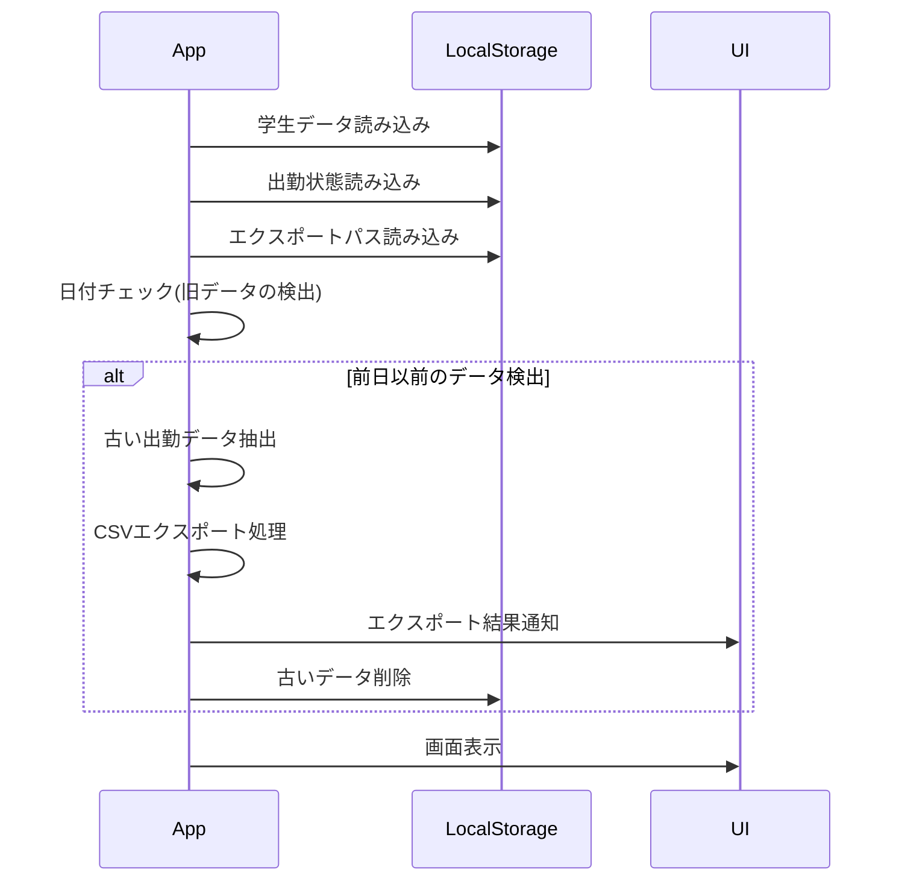
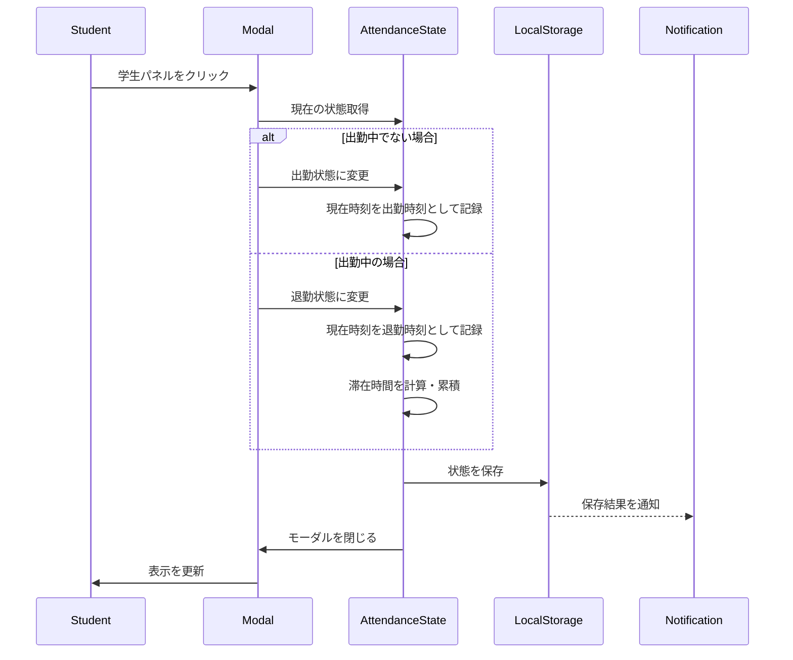
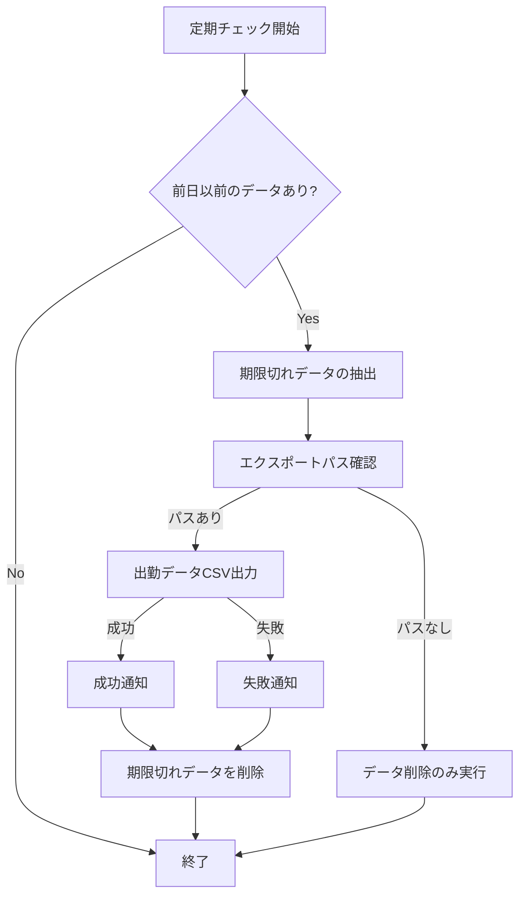
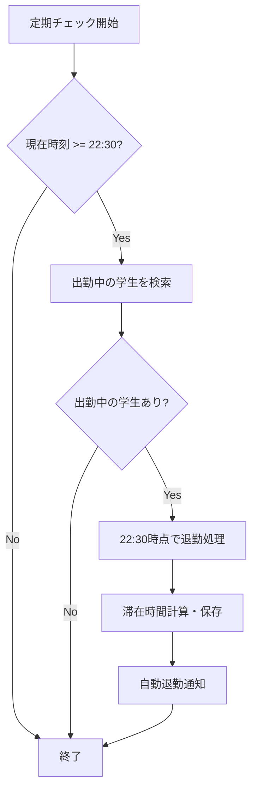
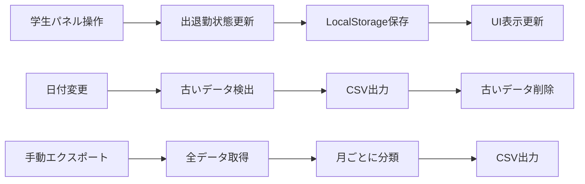
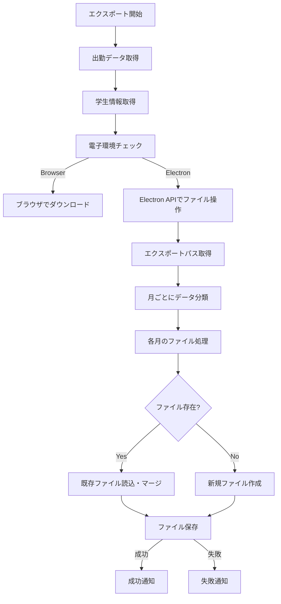

# LAMS (Laboratory Attendance Management System)

## システム概要

LAMSは研究室向けの出退勤管理システムです。学生の出勤・退勤状況を記録し、CSV形式でデータをエクスポートする機能を提供します。

## 主要機能

- 学生の出退勤管理
- 出勤データの自動・手動エクスポート
- 学生情報の管理（追加・削除・編集）
- 出勤統計の表示

## システムロジック・フロー

### 1. アプリケーション起動時



### 2. 出退勤処理フロー



### 3. 自動エクスポート処理

以下の条件でアプリが自動的にデータをエクスポートします：

1. アプリ起動時に前日以前のデータを検出した場合
2. 日付が変わったタイミング（定期チェック）



### 4. 自動退勤処理

22:30を過ぎた時点で出勤中の学生を自動的に退勤状態に更新します：



### 5. 通知が複数回発生するケース

通知が複数回発生するのは主に以下のシナリオです：

1. **出退勤状態変更時の通知シーケンス**
   - ローカルストレージ保存成功通知
   - 状態変更通知（UI更新用）
   - 外部コールバック実行通知（親コンポーネント用）
   - 期限切れデータがある場合のエクスポート通知

2. **エクスポート処理時**
   - エクスポート開始通知
   - 処理状態通知（各ステップ）
   - 結果通知（成功/失敗）
   - 後処理通知（データクリーンアップ等）

## データフロー

### 出勤データの流れ



### CSVエクスポート処理



## データ構造

### 学生データ

```typescript
interface Student {
  id: string;      // 学生ID
  name: string;    // 学生名
  grade: '教員' | 'M2' | 'M1' | 'B4';  // 学年
}
```

### 出勤状態データ

```typescript
interface AttendanceState {
  isAttending: boolean;      // 出勤中かどうか
  attendanceTime: Date | null;  // 出勤時刻
  leavingTime: Date | null;     // 退勤時刻 
  totalStayTime: number;        // 累積滞在時間（秒）
}
```

### CSVエクスポート形式

| 日付 | 学生ID | 学生名 | 出勤日時 | 退勤日時 | 滞在時間（秒） | 滞在時間 |
|------|--------|--------|----------|----------|----------------|----------|
| MM/DD | ID | 名前 | YYYY/MM/DD HH:MM:SS | YYYY/MM/DD HH:MM:SS | 12345 | X時間Y分 |

## 処理タイミングの詳細

### 1. ページロード/コンポーネントマウント時

- 学生データのロード
- 出勤状態のロード
- 期限切れデータのチェックと自動エクスポート
- エクスポート設定のロード
- 定期チェック用インターバル設定（10秒ごと）

### 2. 出退勤ボタン押下時

- 現在時刻の取得（時刻操作モード考慮）
- 状態更新と滞在時間計算
- ローカルストレージへの保存
- 保存結果の通知
- UIの更新（バッジ表示等）

### 3. 22:30チェック（1分ごと）

- 現在時刻が22:30を超えているかチェック
- 出勤中の学生の退勤処理
- 滞在時間の計算と保存
- 自動退勤の通知

### 4. 日付変更時（定期チェック）

- 出勤データと現在日付の比較
- 期限切れデータの抽出とエクスポート
- エクスポート結果の通知
- 古いデータの削除

### 5. 手動エクスポート実行時

- エクスポートパスの確認
- 全出勤データの取得と月ごとの分類
- CSVファイルの生成とマージ
- 結果の通知

